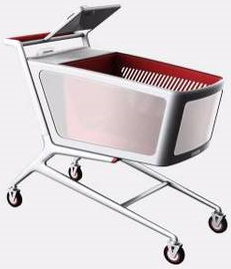

 

The Icart is a self-checkout system designed and developed to eliminate queues in supermarkets.

The anti-theft module of the Icart is equiped with multiple sensors and is able to recongnize if the commodities put in has been entried or are matched with the items recorded in the system. 

Now the Icart has been used in more than fifty supermarkets.

  

 