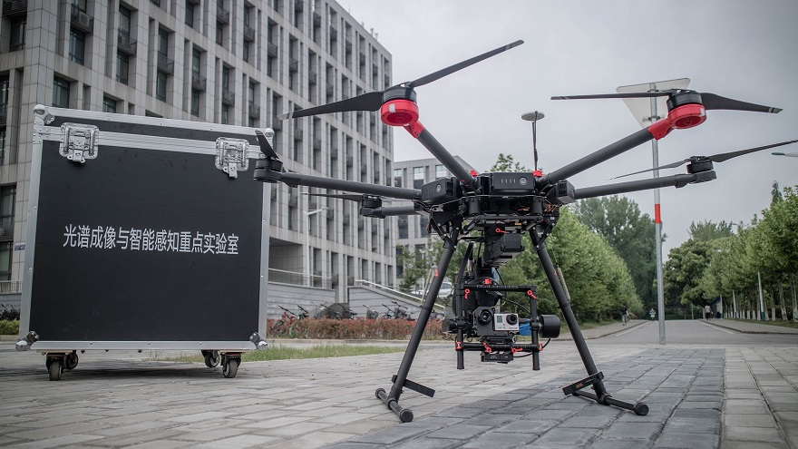
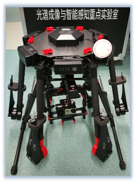
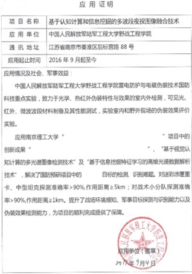

# Integrated Reconnaissance/Strike UAV (IRS UAV)

Major developers: Lianfa Bai, Yi zhang, Jing han, Xiaoyu Chen, Sitong Chen, XiuXiu Chu, Qixing Wang, Junwei Zhu, Mingzhu Li, Jiani Gao, Qin Wang, Canlong Wang, Yonghao Huang.

Jiangsu Key Laboratory of Spectral Imaging & Intelligence Sense, Nanjing University of Science and Technology, Nanjing 210094, china

 

The IRS UVA is a integrated reconnaissance/strike UAV (IRS UAV) stystem that is able to detect and track target and then strike. The IRS UAV is composed of six-rotor unmanned helicopter imaging module and onboard computing platform. We focus the targets containing different types of vehicles, motorways, bridges, etc.

# six-rotor unmanned helicopter

The six-rotor unmanned helicopter is from DJI and the model is M600. M600 provides rich set of instructions for UAV control, and can be controlled to performs various tasks.

# imaging module

To work on both daytime and night, the IRS UAV is equipped with a digital camera and a thermal imager. The digital camera is competent for most of the scenes on daytime, and when it comes to night, the thermal imager can be used to find anomaly targets. Besides, the aligned digital camera and a thermal imager can be used as a multispectral imager for more information.

 

# onboard computing platform

For online real-time reconnaissance and reaction, the data processing is onboard. The onboard computing platform is NVIDIA JETSON TX2, where we perform detection and tracking agrithms. 

# Pictures

# Videos
	  
<video id="video"><source id="wmv" src="imgs/ir.wmv"></video>
      
<video id="video" controls="" preload="none" poster="http://om2bks7xs.bkt.clouddn.com/2017-08-26-Markdown-Advance-Video.jpg">
      <source id="wmv" src="imgs/vis.wmv" type="video/wmv">
      </video>