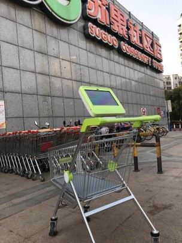
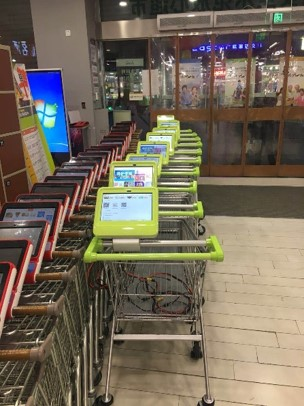
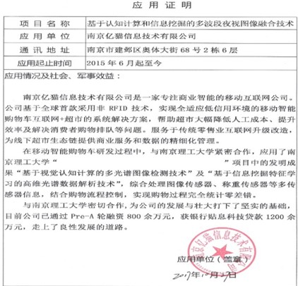

 

The ICart is a self-checkout system designed and developed to eliminate queues in supermarkets.

The anti-theft module of the ICart is equiped with multiple sensors and is able to recongnize if the commodities put in have been entried or are matched with the items recorded in the data management. 

Now the ICarts have been used in more than fifty supermarkets.

# Pictures

 

# Videos
	  
<iframe frameborder="0" src="https://v.qq.com/txp/iframe/player.html?vid=c0319pmd0m2" allowFullScreen="true"></iframe>
	  
<iframe frameborder="0" src="https://v.qq.com/txp/iframe/player.html?vid=k0647bmmsvo" allowFullScreen="true"></iframe>